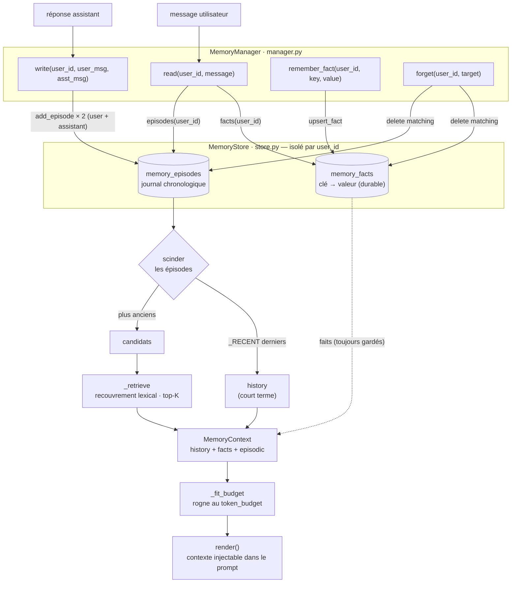

# Mémoire — Vue d'ensemble

_Note de synthèse, 2026-07-07. Fichiers : `src/velmo/memory/{store,manager,__init__}.py`._

> Cette note prend de la hauteur sur le chantier mémoire : le modèle mental, le
> flux complet, et la correspondance avec les six exigences R1–R6. Pour le détail
> d'une brique, voir les notes de palier :
> [1 · persistance](2026-07-07-memoire-palier1-persistance.md) ·
> [2 · faits](2026-07-07-memoire-palier2-faits.md) ·
> [3 · épisodique](2026-07-07-memoire-palier3-episodique.md).

---

## Le modèle mental

La mémoire de Velmo tient en **deux couches** :

- un **cerveau** (`MemoryManager`, `manager.py`) qui *décide* quoi retenir et quoi
  remonter ;
- un **magasin** (`MemoryStore`, `store.py`) qui *range* et *relit*, isolé par
  `user_id`.

Le magasin a lui-même **deux étages complémentaires**, comme le veut la note
d'architecture :

| Étage | Table | Nature | Répond à |
|-------|-------|--------|----------|
| Faits durables | `memory_facts` | clé→valeur, **écrasable** (upsert) | « quelle taille prend ce client ? » |
| Épisodique | `memory_episodes` | journal chronologique, **empilé** | « m'a-t-il déjà parlé de… ? » |

Le `MemoryManager`, lui, distingue dans le temps le **court terme** (les derniers
tours, bruts) du **long terme** (les tours anciens, remontés par pertinence).

---

## Le flux complet

Lecture rapide :

- **Bleu** = les deux tables persistantes (isolées par `user_id`).
- **Ligne pleine** = flux principal ; **pointillé** = les faits, injectés
  directement et jamais sacrifiés par le budget.
- Le nœud `scinder` matérialise la séparation court terme / long terme.

---

## Les quatre gestes

| Geste | Rôle | Étage touché |
|-------|------|--------------|
| `read` | assembler le contexte pertinent (faits + récents + rappel), tenu au budget | lit les deux |
| `write` | retenir un échange (deux épisodes horodatés) | épisodique |
| `remember_fact` | poser un fait durable (upsert) | faits |
| `forget` | droit à l'oubli : supprimer ce qui mentionne une cible | les deux |

---

## Correspondance avec les exigences R1–R6

| Exigence | Où c'est tenu |
|----------|---------------|
| **R1** — rappel sur longue conversation | `read` → `_retrieve` (recouvrement lexical sur les tours anciens) |
| **R2** — persistance multi-session | store sur **fichier** SQLite / Postgres (pas de RAM volatile) |
| **R3** — isolation par utilisateur | `WHERE user_id = ?` à **chaque** requête du store |
| **R4** — tenue de la fenêtre de contexte | `_fit_budget` (rogne au `token_budget`, faits préservés) |
| **R5** — droit à l'oubli | `forget` (suppression ciblée dans les deux étages) |
| **R6** — traçabilité | épisodes horodatés + `inspect(user_id)` |

---

## Hors-ligne vs production

Même code, deux backends, choisis par variable d'environnement :

- **Hors-ligne** (défaut) : fichier `~/.velmo/memory.db` — vraie persistance
  multi-session sans aucun service.
- **Production** : `MEMORY_DB_URL` pointe vers Postgres (source de vérité
  partagée).

---

## Ce qui reste (raffinements, pas des trous)

- **Rappel sémantique (Chroma)** : `_retrieve` matche des mots, pas du sens. Le
  point d'accroche est prêt derrière l'interface `MemoryStore`.
- **Extraction de faits par LLM** : aujourd'hui un fait ne s'écrit que via
  `remember_fact` explicite.
- **Résumé du vieux contexte** : compresser plutôt que couper au budget.

Le chantier mémoire (R1–R6) est fonctionnellement bouclé ; les 4 tests
d'acceptance mémoire passent.
