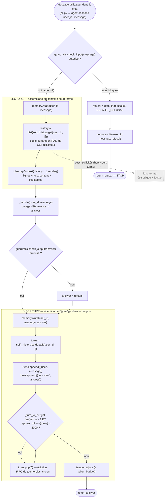
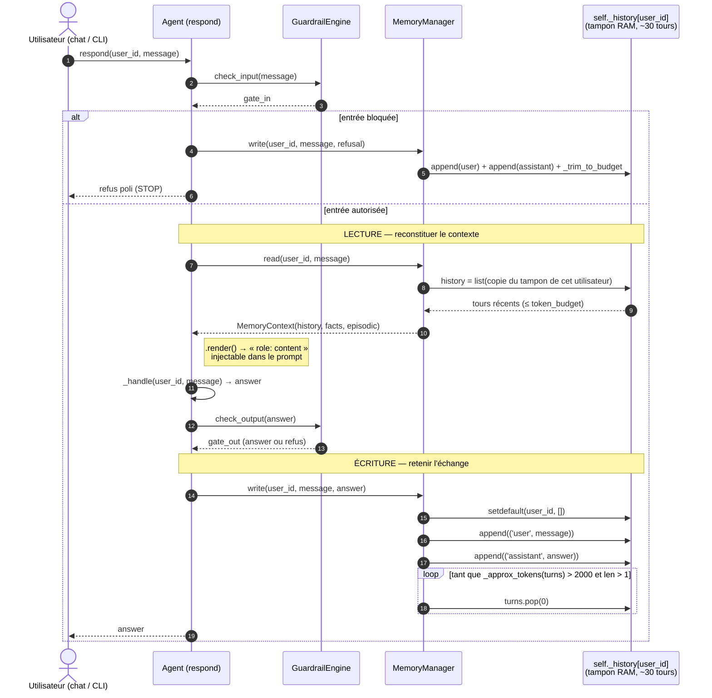

# 2026-07-12 — Cheminement de la mémoire à court terme (les ~30 tours)

_Note explicative, niveau débutant Python / agents IA._

- **Date :** 2026-07-12
- **Commit de référence :** `8a62a3a` — _feat: [MEMORY] add persistent long-term
  factual memory per user_
- **Point de départ retenu :** un message de l'utilisateur dans le chat.
- **Fichiers compagnons :**
  - `2026-07-12-memoire-court-terme-schema-flux.mmd` (schéma de flux, Mermaid)
  - `2026-07-12-memoire-court-terme-diagramme-flux.mmd` (diagramme de séquence, Mermaid)

---

## 1. De quoi parle-t-on ?

La mémoire à court terme, c'est **le tampon en RAM** qui répond à la question
« de quoi parle-t-on *là, maintenant* ? ». Dans Velmo, c'est un simple
dictionnaire Python porté par `MemoryManager`, dans
`src/velmo/memory/__init__.py` :

```python
self._history: dict[str, list[Turn]] = {}   # Turn = tuple[str, str] = (role, content)
```

La clé est le `user_id` : **chaque utilisateur a sa propre liste de tours**.
C'est ce qui garantit l'isolation (Marc ne peut structurellement pas lire la
liste de Sophie — ce sont deux entrées distinctes du dictionnaire). Ce tampon
vit dans le process et **disparaît à sa fin** : la persistance durable est le
travail des étages long terme (factuel / épisodique).

> Les « ~30 tours » ne sont pas une constante du code : le tampon garde **autant
> de tours récents que le budget le permet** (`token_budget = 2000`). Le test
> d'acceptance `test_recall_over_30_turns` écrit 30+ tours courts, qui tiennent
> tous sous le budget — d'où le rappel de l'info du 1ᵉʳ tour (exigence R1).

---

## 2. Le cheminement, pas à pas

Le trajet d'un message est fixé dans `Agent.respond()` (`src/velmo/agent.py`).
Côté court terme, il y a **deux moments** : on *lit* le tampon avant de répondre,
on *écrit* dedans après.

### Étape 0 — Le message arrive

L'utilisateur tape dans le chat (REPL `cli.py` ou tout autre canal), ce qui
appelle `agent.respond(user_id, message)`.

### Étape 1 — Garde-fou d'entrée (avant toute mémoire)

```python
gate_in = self.guardrails.check_input(message)
if not gate_in.allowed:
    refusal = gate_in.refusal or DEFAULT_REFUSAL
    self.memory.write(user_id, message, refusal)   # ← on écrit MÊME un refus
    return refusal
```

Point important : **même un message refusé est mémorisé** (avec la réponse de
refus). La conversation reste cohérente : le tour existe bel et bien pour cet
utilisateur.

### Étape 2 — LECTURE : `memory.read(user_id, message)`

```python
def read(self, user_id, message):
    history = list(self._history.get(user_id, []))   # copie du tampon de CET user
    ...
    return MemoryContext(history=history, episodic=episodic, facts=facts)
```

Ce qui compte pour le court terme :

- `self._history.get(user_id, [])` — on récupère la liste de l'utilisateur, ou
  une liste vide s'il n'a jamais parlé.
- `list(...)` — on en fait une **copie**. On restitue un instantané ; le code
  appelant ne peut pas modifier le tampon par accident.

Le contexte est ensuite sérialisé par `MemoryContext.render()` en lignes
`role: content` — le format prêt à injecter dans un prompt.

### Étape 3 — Routage et réponse

`_handle()` produit la réponse (`answer`) via le routage déterministe
(regex / mots-clés, outils métier, FAQ, ou repli LLM). Puis le garde-fou de
sortie peut la remplacer par un refus.

### Étape 4 — ÉCRITURE : `memory.write(user_id, message, answer)`

C'est le cœur du court terme.

```python
def write(self, user_id, user_message, assistant_message):
    turns = self._history.setdefault(user_id, [])      # liste de l'user (créée si absente)
    turns.append(("user", user_message))               # 1 tour = 2 entrées :
    turns.append(("assistant", assistant_message))     #   le message + la réponse
    self._trim_to_budget(turns)                        # on rogne si trop gros
    ...
```

- `setdefault` : idiome Python pour « donne-moi la liste, ou crée-la vide si
  elle n'existe pas encore ».
- On ajoute **deux entrées** par échange : le tour utilisateur puis le tour
  assistant.

### Étape 5 — Tenir la fenêtre : `_trim_to_budget` (exigence R4)

```python
def _trim_to_budget(self, turns):
    while len(turns) > 1 and self._approx_tokens(turns) > self.token_budget:
        turns.pop(0)   # on jette le tour le PLUS ANCIEN
```

Tant que le tampon dépasse le budget (`2000` tokens), on retire le plus ancien
tour — une **éviction FIFO** (_first in, first out_). Le comptage est volontairement
grossier (pas de vrai tokenizer) : `~4 caractères = 1 token`.

C'est exactement le mécanisme qui « tient la fenêtre de contexte » : la mémoire
récente est préservée, le vieux contexte hors budget est abandonné.

---

## 3. Schéma de flux (structurel)

Le trajet de la donnée et ses branches (entrée bloquée vs autorisée, boucle de
rognage). Source : `2026-07-12-memoire-court-terme-schema-flux.mmd`.



---

## 4. Diagramme de flux (séquence)

Les mêmes étapes, vues comme des **échanges dans le temps** entre composants.
Source : `2026-07-12-memoire-court-terme-diagramme-flux.mmd`.



---

## 5. Ce qu'il faut retenir

1. **Un dict, une liste par `user_id`** → isolation gratuite entre utilisateurs.
2. **Lecture = copie** du tampon (instantané, pas de mutation accidentelle).
3. **Écriture = 2 entrées** (user + assistant) puis **rognage FIFO** au budget.
4. **Le refus se mémorise aussi** — la conversation reste cohérente.
5. Le court terme **ne persiste pas** au-delà du process : c'est le rôle des
   étages long terme, non traités ici.
