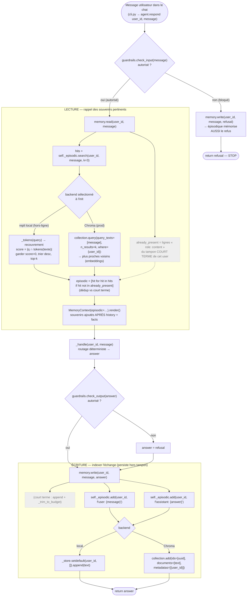
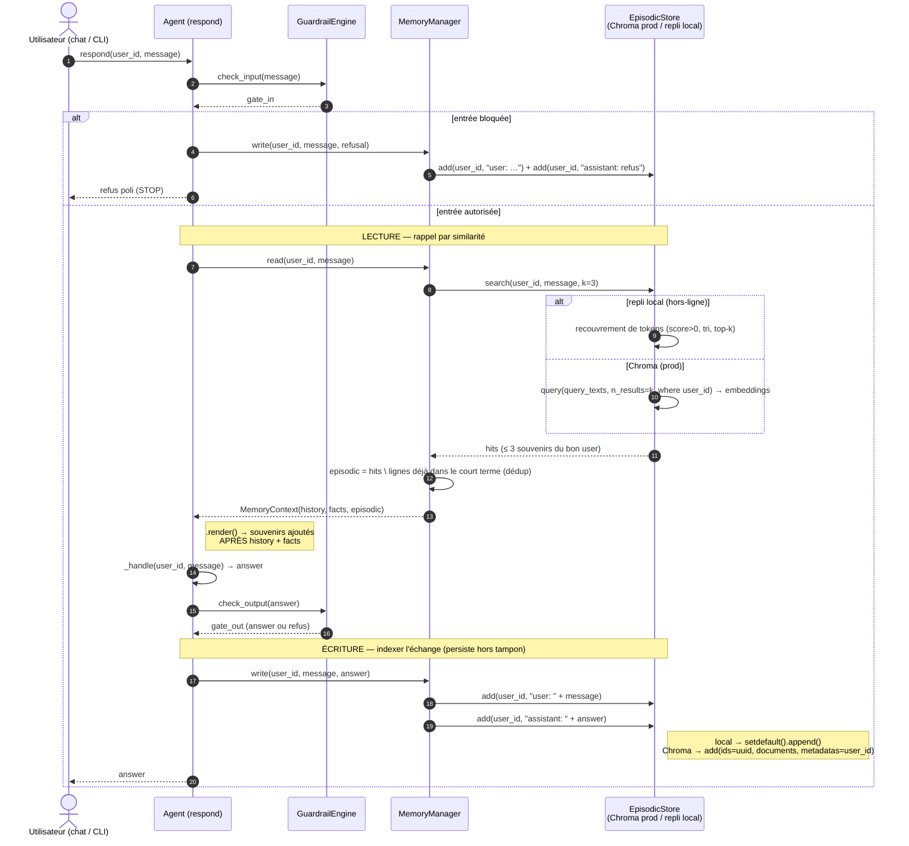

# 2026-07-12 — Cheminement de la mémoire long terme épisodique

_Note explicative, niveau débutant Python / agents IA._

- **Date :** 2026-07-12
- **Commit de référence :** `8a62a3a` — _feat: [MEMORY] add persistent long-term
  factual memory per user_
- **Point de départ retenu :** un message de l'utilisateur dans le chat.
- **Fichiers compagnons :**
  - `2026-07-12-memoire-episodique-schema-flux.mmd` (schéma de flux, Mermaid)
  - `2026-07-12-memoire-episodique-diagramme-flux.mmd` (diagramme de séquence, Mermaid)

---

## 1. De quoi parle-t-on ?

La mémoire **épisodique** répond à une question que le court terme ne sait pas
traiter : « **m'a-t-il déjà parlé de ça, même il y a longtemps ?** ». Là où le
tampon court terme ne garde que les tours récents (et jette les vieux au budget),
l'épisodique **conserve tous les échanges** et les retrouve **par similarité**
avec le message courant — même s'ils sont sortis du tampon.

Le code est dans `src/velmo/memory/episodic.py`. Il suit le **même patron que
`kb_store.py`** : une interface commune (`EpisodicStore`, un `Protocol`) et deux
implémentations interchangeables, choisies à l'exécution.

| Backend | Quand ? | Comment il retrouve |
|---------|---------|---------------------|
| `LocalEpisodicStore` | hors-ligne (défaut, tests) | **recouvrement de tokens** : combien de mots en commun entre la requête et chaque souvenir |
| `ChromaEpisodicStore` | prod (`CHROMA_URL` défini) | **recherche sémantique** : plus proches voisins par _embeddings_ |

Le choix se fait une seule fois, dans `get_episodic_store()` :

```python
def get_episodic_store():
    if not os.getenv("CHROMA_URL"):
        return LocalEpisodicStore()      # repli hors-ligne
    try:
        import chromadb ...
    except ImportError:
        return LocalEpisodicStore()      # Chroma absent → repli
    ...
    return ChromaEpisodicStore(collection)
```

C'est ce repli qui rend la suite de tests exécutable **sans aucun service
externe** — exactement la philosophie « hors-ligne » du projet.

> **Isolation par `user_id`** (exigence non négociable) : en local, c'est la clé
> d'un dictionnaire (`self._store[user_id]`) ; sous Chroma, c'est un filtre de
> métadonnée (`where={"user_id": user_id}`) à la recherche et à la suppression.

---

## 2. Le cheminement, pas à pas

Comme pour le court terme, il y a **deux moments** dans `Agent.respond()`
(`src/velmo/agent.py`) : on *lit* l'épisodique avant de répondre, on *écrit*
dedans après. L'orchestration vit dans `MemoryManager`
(`src/velmo/memory/__init__.py`).

### Étape 0 — Le message arrive

`agent.respond(user_id, message)` est appelé depuis le chat.

### Étape 1 — Garde-fou d'entrée

Si le message est bloqué, `memory.write(...)` est quand même appelé avec le
refus : **l'épisodique indexe aussi l'échange refusé** (comme le court terme).

### Étape 2 — LECTURE : rappel par similarité

Dans `MemoryManager.read()` :

```python
def read(self, user_id, message):
    history = list(self._history.get(user_id, []))
    already_present = {f"{role}: {content}" for role, content in history}
    hits = self._episodic.search(user_id, message, k=_EPISODIC_K)   # _EPISODIC_K = 3
    episodic = [hit for hit in hits if hit not in already_present]   # dédup court terme
    facts = self._facts.all_for(user_id)
    return MemoryContext(history=history, episodic=episodic, facts=facts)
```

Trois idées clés :

1. **`search(user_id, message, k=3)`** ne rapporte que les **3 souvenirs les
   plus proches** du message courant, et **seulement ceux de cet utilisateur**.
   - En local (`LocalEpisodicStore.search`) : on découpe la requête en tokens,
     on compte les mots communs avec chaque souvenir (`len(q & _tokens(text))`),
     on jette les scores nuls, on trie par score décroissant, on garde le top-k.
   - En prod (`ChromaEpisodicStore.search`) : `collection.query(...)` fait le
     même travail mais par **embeddings** (proximité de sens, pas de mots exacts).

2. **Déduplication vis-à-vis du court terme** : un souvenir déjà présent dans le
   tampon récent (`already_present`) est retiré des `hits`. On évite de répéter
   dans le prompt ce que l'historique récent contient déjà.

3. **Hors budget de tokens** : `_EPISODIC_K = 3` est une **borne fixe**, non
   comptée dans `token_budget` (simplification assumée). L'épisodique injecte au
   plus 3 souvenirs, indépendamment de la taille du tampon court terme.

À la sérialisation (`MemoryContext.render()`), les souvenirs épisodiques sont
ajoutés **après** l'historique et les faits.

### Étape 3 — Routage et réponse

`_handle()` produit `answer` (outils métier, FAQ, ou repli LLM), puis le
garde-fou de sortie peut la remplacer par un refus.

### Étape 4 — ÉCRITURE : indexer l'échange

Toujours dans `MemoryManager.write()`, **après** la mise à jour du court terme :

```python
self._episodic.add(user_id, f"user: {user_message}")
self._episodic.add(user_id, f"assistant: {assistant_message}")
```

Chaque moitié de l'échange devient un souvenir indépendant :

- En local (`add`) : `self._store.setdefault(user_id, []).append(text)`.
- En prod (`add`) : `collection.add(ids=[uuid4], documents=[text],
  metadatas=[{"user_id": user_id}])` — un identifiant unique, le texte, et la
  métadonnée d'isolation.

C'est **la différence de fond avec le court terme** : rien n'est jamais évincé
au budget. Un échange indexé ici reste **retrouvable indéfiniment** par
similarité, même longtemps après être sorti du tampon des ~30 tours.

---

## 3. Schéma de flux (structurel)

Le trajet de la donnée et ses branches (entrée bloquée, choix de backend,
déduplication). Source : `2026-07-12-memoire-episodique-schema-flux.mmd`.



---

## 4. Diagramme de flux (séquence)

Les mêmes étapes vues comme des **échanges dans le temps**.
Source : `2026-07-12-memoire-episodique-diagramme-flux.mmd`.



---

## 5. Ce qu'il faut retenir

1. **Épisodique = rappel par similarité**, là où le court terme n'est qu'une
   fenêtre récente.
2. **Deux backends, une interface** : recouvrement de tokens (local, hors-ligne)
   ou embeddings (Chroma, prod) — choisis par `get_episodic_store()`.
3. **Isolation par `user_id`** à chaque opération (clé de dict / filtre `where`).
4. **Lecture** : au plus `k=3` souvenirs, **dédupliqués** contre le court terme,
   ajoutés après history + facts, **hors** `token_budget`.
5. **Écriture** : chaque moitié de l'échange est indexée séparément et
   **persiste** — retrouvable même sortie du tampon des ~30 tours.
6. Le refus est indexé lui aussi, comme dans le court terme.
