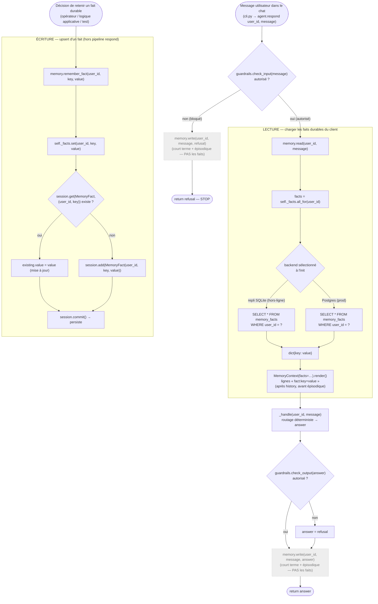
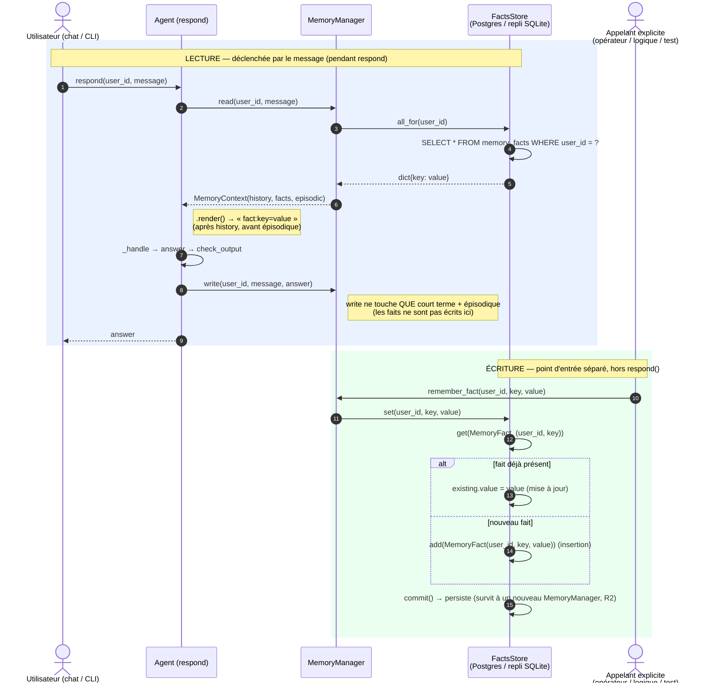

# 2026-07-12 — Cheminement de la mémoire long terme factuelle

_Note explicative, niveau débutant Python / agents IA._

- **Date :** 2026-07-12
- **Commit de référence :** `8a62a3a` — _feat: [MEMORY] add persistent long-term
  factual memory per user_
- **Point de départ retenu :** un message de l'utilisateur dans le chat.
- **Fichiers compagnons :**
  - `2026-07-12-memoire-factuelle-schema-flux.mmd` (schéma de flux, Mermaid)
  - `2026-07-12-memoire-factuelle-diagramme-flux.mmd` (diagramme de séquence, Mermaid)

---

## 1. De quoi parle-t-on ?

La mémoire **factuelle** est la **source de vérité durable** sur un client :
des faits **clé-valeur** exacts (`pointure = L`, `adresse = 12 rue des Lilas`).
Là où l'épisodique fait du rappel **flou** par similarité, le factuel donne une
réponse **exacte** à « quelle valeur pour cette clé, chez ce client ? ».

Le code est dans `src/velmo/memory/facts.py`, sur le **même patron** que
`kb_store.py` / `episodic.py` : une interface `FactsStore` (`Protocol`) et un
backend choisi à l'exécution.

| Backend | Quand ? | Support |
|---------|---------|---------|
| Postgres | prod (`DB_URL` défini) | table `memory_facts` via SQLAlchemy |
| SQLite en mémoire | hors-ligne (défaut, tests) | même table, engine **mis en cache au niveau du module** |

Une seule classe, `SqlFactsStore`, sert les deux cas : seule la
`session_factory` change. Le choix se fait dans `get_facts_store()` :

```python
def get_facts_store():
    if not os.getenv("DB_URL"):
        return SqlFactsStore(_get_local_session_factory())  # repli SQLite
    from ..db import session_factory
    return SqlFactsStore(session_factory())                 # Postgres
```

### La subtilité clé : la persistance (exigence R2)

Le repli SQLite **n'est pas** recréé à chaque `MemoryManager`. L'engine est
gardé dans une variable **de module**, créée une seule fois par process :

```python
_local_session_factory = None

def _get_local_session_factory():
    global _local_session_factory
    if _local_session_factory is None:
        engine = create_engine("sqlite://", future=True)   # une fois
        Base.metadata.create_all(engine)
        _local_session_factory = sessionmaker(bind=engine, ...)
    return _local_session_factory
```

C'est **la différence assumée avec l'épisodique local** : `LocalEpisodicStore`
repart d'un magasin RAM neuf à chaque instanciation, tandis que le factuel doit
**survivre à la création d'un nouveau `MemoryManager`** — c'est le sens même de
la *persistance multi-session* (un fait retenu en session 1 est relu en
session 2, même hors-ligne).

> **Isolation par `user_id`** : toutes les requêtes filtrent `WHERE user_id = ?`.
> La clé primaire de `MemoryFact` est **composite** — `(user_id, key)` — donc
> deux clients peuvent avoir la même clé (`pointure`) sans collision.

---

## 2. Le cheminement, pas à pas

Attention : contrairement au court terme et à l'épisodique, **l'écriture des
faits n'est pas branchée sur le pipeline automatique** `respond()`. Il y a donc
**deux chemins distincts**.

### Chemin A — LECTURE, déclenchée par le message (dans `respond()`)

Dans `MemoryManager.read()` :

```python
facts = self._facts.all_for(user_id)
return MemoryContext(history=history, episodic=episodic, facts=facts)
```

`all_for()` fait un simple `SELECT` filtré par utilisateur et renvoie un
dictionnaire :

```python
def all_for(self, user_id):
    with self._session_factory() as session:
        rows = session.scalars(
            select(MemoryFact).where(MemoryFact.user_id == user_id)
        ).all()
        return {row.key: row.value for row in rows}
```

À la sérialisation (`MemoryContext.render()`), chaque fait devient une ligne
`fact:key=value`, insérée **après l'historique et avant l'épisodique**. Le LLM
(ou le formatage) dispose ainsi des vérités durables du client au moment de
répondre.

### Chemin B — ÉCRITURE, via un point d'entrée explicite

L'écriture passe par `MemoryManager.remember_fact()`, appelé **hors** de
`respond()` (par de la logique applicative, un opérateur, ou les tests — jamais
automatiquement par le pipeline de chat aujourd'hui) :

```python
def remember_fact(self, user_id, key, value):
    self._facts.set(user_id, key, value)
```

`set()` réalise un **upsert** (update-or-insert) sur la clé composite :

```python
def set(self, user_id, key, value):
    with self._session_factory() as session:
        existing = session.get(MemoryFact, (user_id, key))
        if existing is not None:
            existing.value = value          # la clé existe → on met à jour
        else:
            session.add(MemoryFact(user_id=user_id, key=key, value=value))  # sinon on insère
        session.commit()                    # persiste
```

Conséquence directe (testée) : réécrire `pointure` remplace l'ancienne valeur au
lieu d'en accumuler une seconde — un fait durable a **une** valeur courante.

### Le droit à l'oubli (`forget`, exigence R5)

`MemoryManager.forget()` purge les trois étages ; côté factuel, `SqlFactsStore.forget()`
supprime toute ligne dont **la clé ou la valeur** contient la cible :

```python
matches = [row for row in rows if target in row.key.lower() or target in row.value.lower()]
for row in matches:
    session.delete(row)
```

---

## 3. Schéma de flux (structurel)

Les deux chemins (lecture pendant `respond`, écriture via `remember_fact`) et
leurs branches. Source : `2026-07-12-memoire-factuelle-schema-flux.mmd`.



---

## 4. Diagramme de flux (séquence)

Les deux flux vus comme des **échanges dans le temps**.
Source : `2026-07-12-memoire-factuelle-diagramme-flux.mmd`.



---

## 5. Ce qu'il faut retenir

1. **Factuel = vérité exacte et durable** (clé-valeur par client), en base
   relationnelle — complément du rappel flou de l'épisodique.
2. **Une classe, deux backends** : Postgres (`DB_URL`) ou repli SQLite, choisis
   par `get_facts_store()`.
3. **Persistance R2** : le repli SQLite est **caché au niveau du module** → il
   **survit à un nouveau `MemoryManager`** (contrairement à l'épisodique local).
4. **Isolation par `user_id`** + **clé primaire composite** `(user_id, key)` →
   pas de collision entre clients.
5. **Lecture** dans `respond()` (`all_for` → `dict` → `fact:key=value`, entre
   history et épisodique).
6. **Écriture hors pipeline** : `remember_fact()` → `set()` fait un **upsert**
   (une clé = une valeur courante). `respond()` **n'écrit jamais** de fait
   automatiquement.
7. **Droit à l'oubli** : `forget()` supprime les faits dont la clé **ou** la
   valeur matche la cible.
