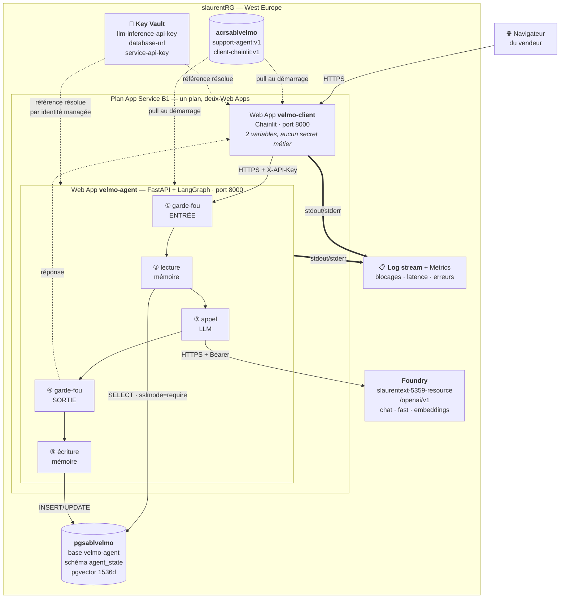

# Dossier de déploiement — Velmo 2.0 sur Azure

**Date :** 2026-08-24
**Objet :** les trois pièces de conception que le brief exige **avant** la mise en ligne —
choix des services, gestion des secrets, schéma de déploiement cible.
**Se lit avec :** [`plan-deploiement-2026-07-25.md`](plan-deploiement-2026-07-25.md) (le
raisonnement long) et [`deployement-journaling/`](deployement-journaling/) (l'exécution
réelle, bloc par bloc).

> Ce dossier est écrit **après** les blocs 1 à 3 (registre, service d'IA, base de données)
> et **avant** le bloc 4 (mise en ligne de l'agent). Les valeurs qu'il contient ne sont
> donc pas des intentions : elles ont été provisionnées et vérifiées.

---

## 1. Choix des services Azure

### 1.1 Hébergement de l'agent

L'agent est déjà conteneurisé (deux `Dockerfile`, une pile `compose`). La question n'est
donc pas « conteneur ou pas » mais **quel exécuteur de conteneurs**.

| Critère | **App Service for Containers** ✅ | Container Apps | AKS |
|---|---|---|---|
| **Facilité** | Web App = 1 formulaire, ingress HTTPS et certificat inclus, logs au clic | Proche, mais notions supplémentaires (environnement, révisions, KEDA) | Cluster à administrer |
| **Coût** | Plan B1 ≈ 13 €/mois, payé à l'heure même sans trafic | Peut tomber à ~0 avec le scale-to-zero | Plancher élevé |
| **Adéquation** | 1 conteneur par Web App → **2 Web Apps sur 1 plan** ; pas de scale-to-zero | Le scale-to-zero **ré-indexerait la FAQ à chaque réveil** | Surdimensionné |

**Retenu : App Service for Containers.**

Le point décisif n'est ni le prix ni la simplicité, c'est l'adéquation au comportement
réel de l'application : `knowledge/ingest.py` réindexe la FAQ **au démarrage du
processus**. Un exécuteur qui endort le conteneur pour économiser paierait cette
réindexation à chaque réveil, et la ferait payer à l'utilisateur suivant sous forme de
latence. L'absence de scale-to-zero d'App Service, qui est un défaut sur le papier,
neutralise ici le pire piège du projet.

Coût assumé en contrepartie : le plan se paie à l'heure, trafic ou pas.

> L'objection initiale contre App Service (« taillé pour un conteneur unique ») était mal
> posée : la limite est d'un conteneur **par Web App**, pas par projet. Les trois services
> de `compose.yaml` deviennent **deux Web Apps sur un plan partagé** plus le serveur de
> base de données. Le Compose ne co-localisait rien : il déclarait trois blocs joignables
> par le réseau.

### 1.2 Stockage persistant de la mémoire (exigences R2 et R3)

| Option | R2 — persistance | R3 — isolation par utilisateur | Verdict |
|---|---|---|---|
| Fichier SQLite dans le conteneur | ❌ système de fichiers éphémère | — | Écarté |
| SQLite sur Azure File Share | ⚠️ oui, mais montage à gérer | ⚠️ pas de recherche vectorielle native | Écarté |
| Table Storage / Cosmos DB | ✅ | ✅ | ❌ **aucun adaptateur LangGraph** : réécriture des deux horizons de mémoire |
| **PostgreSQL Flexible Server + pgvector** ✅ | ✅ serveur managé, sauvegardes | ✅ namespace `("memories", user_id)` appliqué **dans la requête** | **Retenu** |

**Retenu : Azure Database for PostgreSQL — Flexible Server, avec l'extension `vector`.**

Trois raisons, dans l'ordre du poids :

1. **Le code sait déjà lui parler.** `PostgresSaver` (mémoire courte) et `PostgresStore`
   (mémoire longue) sont branchés derrière `PERSISTENCE_BACKEND=postgres`. Passer de
   `memory` à `postgres` est **un changement de variable, pas de code**.
2. **La recherche sémantique reste dans la même base.** pgvector évite d'ajouter un
   service de recherche vectorielle séparé — une ressource et un secret de moins.
3. **L'isolation R3 est structurelle.** Les souvenirs sont rangés sous le namespace
   `("memories", user_id)` : un client ne peut pas lire ceux d'un autre, parce que la
   clause est dans la requête et non dans un filtre appliqué après coup.

### 1.3 Service d'IA

**Retenu : ressource Foundry exposant la route OpenAI-compatible `/openai/v1`.**

Motif : `config.py` porte un rail `llm_provider = "openai_compatible"` qui appelle
`init_chat_model(model_provider="openai", base_url=…)` (`llm/factory.py:52-61`). Un
endpoint parlant l'API OpenAI se branche donc **sans une ligne de code modifiée**.

Trois déploiements sur la même ressource — contrainte du code : `llm/embeddings.py:33`
réutilise `llm_inference_endpoint`, il n'existe pas d'endpoint séparé pour les embeddings.

### 1.4 Les ressources, telles que provisionnées

Groupe de ressources unique : **`slaurentRG`**.

| Ressource | Nom | Région | SKU | État |
|---|---|---|---|---|
| Registre de conteneurs | `acrsablvelmo` | West Europe | Basic | ✅ bloc 1 |
| Service d'IA | `slaurentext-5359-resource` | West Europe | S0 | ✅ bloc 2 |
| Base de données | `pgsablvelmo` | West Europe | Burstable B1ms | ✅ bloc 3 |
| Plan App Service | `plan-velmo-prod` | West Europe | Basic B1 | ⏳ bloc 4 |
| Web App agent | `velmo-agent-…` | West Europe | — | ⏳ bloc 4 |
| Web App client | `velmo-client-…` | West Europe | — | ⏳ bloc 6 |
| Coffre de secrets | `kv-velmo-…` | West Europe | Standard | ⏳ bloc 7 |

**Sur la région.** Le brief demande France Central ou Sweden Central ; tout est en **West
Europe**. Écart assumé pour une raison technique : App Service et PostgreSQL **doivent**
être co-localisés — chaque tour de conversation fait plusieurs allers-retours vers la base
(mémoire courte, mémoire longue, écriture après réponse). Le registre et le service d'IA y
étaient déjà ; les disperser aurait ajouté de la latence à chaque échange pour un bénéfice
nul. Les données restent dans l'Union européenne, et le critère « ressources regroupées,
faciles à retrouver et à supprimer » est respecté.

**Ordre de grandeur du coût :** plan B1 ≈ 13 €/mois · Postgres B1ms ≈ 12-15 €/mois · ACR
Basic ≈ 4 €/mois · Foundry à l'usage. **Le plan et la base se paient même sans trafic**,
d'où la suppression du groupe après démonstration.

---

## 2. Gestion des secrets et de la configuration

### 2.1 Les secrets — liste complète

Un secret est une valeur dont la divulgation donne un accès ou coûte de l'argent.

| # | Secret | Ce qu'il ouvre | Où il est produit | Destination Azure |
|---|---|---|---|---|
| 1 | `LLM_INFERENCE_API_KEY` | Le service d'IA — **facturé à l'usage** | Foundry → *Clés et point de terminaison* | Key Vault → `llm-inference-api-key` |
| 2 | `DATABASE_URL` | **Toute la mémoire des clients** (contient le mot de passe) | Composée à la main (bloc 3) | Key Vault → `database-url` |
| 3 | `API_KEY` | L'API de l'agent, donc indirectement le budget LLM | `secrets.token_urlsafe(32)` | Key Vault → `service-api-key` |
| 4 | `AGENT_API_KEY` *(côté client)* | Même valeur que `API_KEY`, vue de l'appelant | idem | Key Vault → `service-api-key` |
| 5 | `DOCKER_REGISTRY_SERVER_PASSWORD` | Le registre d'images | ACR → *Clés d'accès* | **Géré par App Service**, jamais transmis au conteneur |

Le n°5 mérite sa ligne : App Service le renseigne lui-même au moment de choisir l'image, et
Microsoft documente que les variables `DOCKER_REGISTRY_SERVER_*` **ne sont pas passées à
l'application**. Il n'y a donc rien à faire pour qu'il reste hors de portée du code.

Les n°3 et n°4 sont **une seule valeur sous deux noms** : la même clé vue du serveur qui la
vérifie (`server.py:83` `require_api_key`) et de l'appelant qui la présente
(`agent_client.py:64`).

### 2.2 Les paramètres à externaliser — non secrets, mais hors du code

Le brief demande explicitement d'y faire figurer les **seuils des garde-fous**. Tous
proviennent de `config.py`.

**Service d'IA**

| Variable | Valeur retenue |
|---|---|
| `LLM_PROVIDER` | `openai_compatible` |
| `LLM_MODEL` | `gpt-5.6-sol` *(nom du **déploiement**)* |
| `LLM_FAST_MODEL` | `gpt-5.6-luna` |
| `LLM_INFERENCE_ENDPOINT` | `https://slaurentext-5359-resource.openai.azure.com/openai/v1` |
| `EMBEDDINGS_PROVIDER` | `openai_compatible` |
| `EMBEDDINGS_MODEL` | `text-embedding-3-small` (1536 dimensions) |

**Mémoire et rétention**

| Variable | Valeur | Portée |
|---|---|---|
| `PERSISTENCE_BACKEND` | `postgres` *(`memory` au bloc 4, bascule au bloc 5)* | R2 |
| `DATABASE_SCHEMA` | `agent_state` | |
| `MEMORY_TTL_DAYS` | `365` | **RGPD** — compteur relancé au dernier accès |
| `MEMORY_TTL_SWEEP_INTERVAL_MINUTES` | `60` | |
| `COMPACT_AFTER_MESSAGES` / `COMPACT_KEEP_LAST_MESSAGES` | `30` / `10` | R4 |
| `FORGET_MIN_SCORE` | `0.35` | R5 — droit à l'oubli |

**Garde-fous** *(exigés nommément par le brief)*

| Variable | Valeur | Ce qu'elle règle |
|---|---|---|
| `GUARDRAILS_ENABLED` | `true` | **Critère de performance du brief** |
| `GUARDRAILS_MAX_INPUT_CHARS` | `4000` | Taille max d'un message entrant |
| `GUARDRAILS_MAX_TOOL_FIELD_CHARS` | `2000` | Taille max d'un champ passé à un outil |
| `GUARDRAILS_ACTION_RATE_LIMIT` | `5` | Actions métier par fenêtre |
| `GUARDRAILS_ACTION_RATE_WINDOW_S` | `3600` | Largeur de la fenêtre |
| `GUARDRAILS_OWNED_EMAIL_DOMAINS` | `velmo.example` | Domaines considérés comme internes |

**Exposition HTTP et divers**

| Variable | Valeur |
|---|---|
| `API_ALLOW_UNAUTHENTICATED` | **`false`** — jamais `true` en ligne |
| `KNOWLEDGE_DIR` | `/app/data/kb-velmo` (chemin **absolu** dans l'image) |
| `SUPPORT_BACKEND` | `memory` (voir §5) |
| `WEBSITES_PORT` | `8000` — instruction au routeur d'Azure, pas une variable du code |

### 2.3 Où et comment, côté Azure

**Deux niveaux, dans cet ordre :**

1. **App settings de la Web App** — chiffrés au repos, injectés comme variables
   d'environnement au démarrage du conteneur. C'est là que **tout** commence, valeurs en
   clair comprises.
2. **Key Vault, en mode RBAC** — les trois secrets y sont déposés, la Web App reçoit une
   **identité managée système**, le rôle *Key Vault Secrets User* lui est accordé, et
   chaque valeur secrète des app settings est remplacée par une **référence** :

   ```
   @Microsoft.KeyVault(VaultName=kv-velmo-xxx;SecretName=llm-inference-api-key)
   ```

**Pourquoi les app settings d'abord et le coffre ensuite** — c'est un choix de méthode, pas
un raccourci. Si les références sont posées avant que le système ait été vu fonctionner,
une panne devient indécidable : clé fausse, ou référence non résolue ? Deux causes qui se
ressemblent. On établit d'abord que ça marche, puis on remplace chaque valeur par sa
référence : à partir de là, toute panne est imputable à la référence.

**Ce que le coffre ajoute** — et ce qu'il n'ajoute pas. Le critère du brief (« aucun secret
dans le code, tout externalisé côté Azure ») est **déjà rempli** par les app settings. Le
coffre apporte la **rotation**, l'**audit** des accès, et un secret que la seule ouverture
du portail ne suffit plus à lire.

### 2.4 Ce qui garantit l'absence de secrets dans le dépôt

| Mécanisme | Effet |
|---|---|
| `.gitignore` → `.env`, `.env.*`, `*.db` | Aucun secret ni base ne peut être commité |
| `.dockerignore` → `.env`, `.env.*`, `database/` | Aucun secret ni état runtime n'entre dans l'image |
| `.env.example` | Documente les **noms** des variables, jamais leurs valeurs |
| Saisie interactive | `docker login` et les vérifications ont demandé les mots de passe au clavier : rien dans l'historique du shell |
| `config.py` | Toutes les valeurs viennent de l'environnement ; aucune constante secrète |

---

## 3. Schéma de déploiement cible



### La chaîne de traitement, dans l'ordre

Le brief demande que la chaîne **garde-fous → mémoire → LLM** soit préservée. Elle l'est,
et elle est numérotée sur le schéma :

| # | Étape | Où c'est dans le code |
|---|---|---|
| ① | **Garde-fou d'entrée** — longueur, injection de prompt, modération | `guardrails/input_guard.py` |
| ② | **Lecture mémoire** — fil en cours + faits durables du client | `memory/short_term.py`, `memory/long_term.py` |
| ③ | **Appel au LLM** — via la route OpenAI-compatible | `llm/factory.py` |
| ④ | **Garde-fou de sortie** — PII, fuite de secrets | `guardrails/output_guard.py`, `guardrails/pii.py` |
| ⑤ | **Écriture mémoire** — checkpoint du fil + consolidation des faits | `memory/consolidate.py` |

### Où passent les secrets

- **Traits pointillés depuis le Key Vault** : les valeurs ne transitent **jamais** par le
  navigateur ni par le client. La Web App résout la référence à son démarrage, via son
  identité managée, et la valeur n'existe qu'en mémoire du processus.
- **Le client ne reçoit ni clé LLM, ni `DATABASE_URL`, ni `KNOWLEDGE_DIR`.** Il connaît
  deux variables : `AGENT_API_URL` et `AGENT_API_KEY`. Si l'interface est compromise, elle
  ne divulgue ni le modèle, ni la base. C'est le bénéfice de sécurité du découpage en deux
  Web Apps — et il est **vérifié**, pas supposé : le smoke test du bloc 1 contrôle que
  l'image du client ne contient ni `support_agent`, ni `langchain`, ni `langgraph`.
- **Le mot de passe du registre** est détenu par App Service et n'atteint pas le conteneur.

### Où sont lus et écrits les journaux

- **Écriture** : les deux conteneurs écrivent sur `stdout`/`stderr` (`PYTHONUNBUFFERED=1`
  dans les deux `Dockerfile` — sans quoi les logs arriveraient par paquets, ou jamais si le
  processus est tué).
- **Lecture** : Web App → `Monitoring` → **`Log stream`**, après avoir activé
  `App Service logs` → `Application logging` → `File System`. Également accessible sur
  `https://<app>.scm.azurewebsites.net/api/logs/docker`.
- **Métriques** : Web App → `Monitoring` → `Metrics` — *Response Time* (latence par
  conversation), *Http 5xx*, *Http 401*, *Requests*, *CPU / Memory working set*.
- **Ce qui est journalisé côté application** : les blocages de garde-fous (entrée et
  sortie) et les opérations mémoire. C'est cette trace qui fournira le **taux de blocage**
  demandé par le brief, et qui rend un blocage **auditable** — un garde-fou qui bloque sans
  journaliser ne compte pas.

---

## 4. Plan de la mémoire persistante (R2, R3)

### Ce qui est stocké, et où

Une seule base, `velmo-agent`, un seul schéma, `agent_state`, deux horizons de mémoire :

| Horizon | Composant | Clé | Contenu |
|---|---|---|---|
| **Court terme** | `PostgresSaver` | `thread_id` | Historique du fil, état du graphe, escalades suspendues |
| **Long terme** | `PostgresStore` | `("memories", user_id)` | Faits durables du client, embeddés en pgvector (1536 dim.) |

Les tables sont créées **par le code** au premier démarrage (`setup()`), pas à la main.
L'extension `vector` a été autorisée au niveau serveur (`azure.extensions = VECTOR`) puis
créée dans la base — sans quoi ce `setup()` échouerait au démarrage du conteneur.

### R2 — persistance entre sessions

La mémoire ne vit plus dans le processus : elle vit dans un serveur managé, avec
sauvegardes. Un redémarrage de la Web App, un redéploiement, un changement d'app setting
ne l'effacent pas.

**Comment ce sera prouvé (bloc 5)** : donner un fait à l'agent, **redémarrer** la Web App,
rouvrir avec le **même `user_id`** et un **`thread_id` neuf** — le fait doit être retrouvé.

### R3 — isolation par utilisateur

Les souvenirs sont rangés sous `("memories", user_id)`. La clause d'isolation est **dans la
requête**, pas dans un filtre appliqué après la lecture : un souvenir étranger ne sort pas
de la base.

**Comment ce sera prouvé** : la même question avec un **autre `user_id`** doit donner « je
ne sais pas ». Sans cette contre-épreuve, on confondrait « la mémoire fonctionne » et « la
mémoire fuit ».

### Rétention (RGPD)

`MEMORY_TTL_DAYS=365` arme un balayage de fond qui supprime les souvenirs périmés, avec un
compteur qui repart au **dernier accès** et non à la création. Réglage ignoré par les
backends `memory` et `sqlite` : il ne prend effet qu'ici, en production.

---

## 5. Limites assumées, et ce qu'elles impliquent

Les nommer fait partie du dossier : une limite écrite est un choix, une limite tue est un
défaut.

**1. L'identité de l'appelant n'est pas prouvée.** Le `user_id` vient du corps de la requête
(`server.py:60` `_resolve_user_id`). L'isolation R3 est donc **vraie au niveau du
stockage** et **déclarative au niveau de l'appelant** : quiconque détient la clé de service
peut se déclarer un autre `user_id`. La parade serait un JWT vérifié côté serveur
(Entra ID / App Service Authentication).

**2. Les données métier ne sont pas persistées** (`SUPPORT_BACKEND=memory`). C'est un choix
de conception, pas un manque : `database/README.md` pose que le double marchand
« représente un système tiers », remplacé en production par des appels au SI du marchand.
Mettre les commandes dans la base de l'agent confondrait ce que l'agent **sait** et ce que
la boutique **possède**. Conséquence pratique : un échange effectué pendant une
démonstration est perdu au redémarrage.

**3. La FAQ est réindexée à chaque démarrage.** Le choix d'App Service rend le défaut
indolore (pas de scale-to-zero), il ne le corrige pas. Il redeviendrait réel au-delà d'une
instance : chacune indexerait la FAQ pour son compte.

**4. La base est joignable par tous les services Azure.** La case « autoriser l'accès public
depuis n'importe quel service Azure » est ce qui laisse passer la Web App ; elle ouvre
aussi le serveur aux services d'autres clients, la protection restant le couple
utilisateur/mot de passe. Un VNet privé serait plus propre, mais ranimerait le piège
`tiktoken` (sortie réseau restreinte = conteneur qui ne démarre pas). **Améliorable sans
recréer le serveur** : les règles de pare-feu sont modifiables, on pourra les restreindre
aux IP sortantes du plan App Service une fois celui-ci créé.

**5. Le déploiement n'est pas automatisé.** Une nouvelle version = rebuild, push, mise à
jour du tag. La suite naturelle est GitHub Actions → ACR, qui fermerait le CD annoncé dans
`ci.md`.

---

## 6. Ce qui reste à provisionner

| Bloc | Contenu | Preuve attendue |
|---|---|---|
| 4 | Plan B1 + Web App `agent-api` en `PERSISTENCE_BACKEND=memory` | `/health` et `/ready` à 200 |
| 5 | Bascule vers `postgres` | R2 et R3 vérifiés |
| 6 | Web App `client` | Conversation complète dans le navigateur |
| 7 | Key Vault + références | Références résolues dans les app settings |
| 8 | Journaux et métriques | Latence, erreurs, taux de blocage relevés |
| 9 | Tests d'acceptance en ligne | Les 8 cas passent |

**Ordre non négociable.** Le bloc 4 déploie l'agent en mémoire volatile : s'il échoue, la
cause est l'image, l'ingress, le service d'IA ou les secrets — **jamais** la base. Un échec
au bloc 5 ne peut plus être que la base. Un suspect à la fois.
