# 🏭 Latence — mises en place « propres » des 4 leviers prod

> Note de référence (cible **niveau 2**, pas du code de tuto). `docs/latence.md`
> mesure d'où viennent nos ~5 s (**3 hops LLM séquentiels**) et **liste** les leviers
> prod ; `docs/prompt-caching.md` en traite un. Ce doc-ci fait le **COMMENT** des
> quatre autres : à quoi ressemblerait une implémentation propre de
> **(1) fusionner le router**, **(2) router par embeddings**, **(3) retrieval
> parallèle**, **(4) cache sémantique de réponses**.
>
> ⚠️ **Code illustratif, pas branché.** Les extraits ci-dessous sont des *croquis*
> de design (noms `retriever`, `answer_cache`, `last_human_text(...)` supposés) pour
> montrer la forme, pas du code à coller tel quel dans `graph/`. On les documente
> comme **cible**, on ne les code pas maintenant (une phase à la fois).

## Le principe qui commande les quatre

On n'optimise pas « le nombre de nœuds » mais **le nombre d'appels LLM sur le chemin
critique** (ce que le client attend avant le 1er token, cf. [`latence.md`](latence.md)).
La règle :

> **Chemin critique le plus court possible ; tout le reste devient déterministe,
> parallèle, caché ou asynchrone.**

Nos 3 hops = `router` (LLM) → `model` décision (LLM) → `model` réponse (LLM). Les
quatre leviers attaquent chacun un morceau ; combinés, le **chemin rapide** tombe à
**1 hop** (réponse seule), voire **0** (cache sémantique). L'agnosticisme est
préservé : les embeddings passent par la [factory](glossaire.md), le cache par un
store commutable — mêmes principes que le provider LLM.

---

## Lever 1 — Fusionner le router (−1 hop)

**POURQUOI.** Notre `router` est un **hop LLM dédié** à la classification d'intention.
Un agent tool-calling standard n'en a pas : il **fond** cette décision dans le
tool-calling natif du modèle (« j'appelle un outil OU je réponds » — un seul appel).
Supprimer le nœud `router` fait passer **3 → 2 hops** (≈ −0.9 s mesuré).

**COMMENT.** Le modèle support (déjà `bind_tools`) décide tout en un passage.
L'escalade, qui a besoin de rester **déterministe**, devient un **outil** dont
l'appel déclenche l'`interrupt` — plus besoin d'une branche LLM en amont. Une arête
conditionnelle **lit les `tool_calls`** (aucun appel LLM) pour router la suite :

```python
# Fewer hops: no standalone router LLM call. The ONE support model, bound with
# tools, decides in a single pass whether to answer, retrieve, or hand off — the
# intent "routing" is folded into native tool-calling instead of a separate hop.
ESCALATE_TOOL = "escalate_to_human"

def route_after_model(state: SupportState) -> str:
    """Conditional edge read from the model's tool calls — NO extra LLM call.

    The classification the router used to do is now a by-product of the model's
    own tool-choice: if it asked to escalate -> human handoff; if it asked for any
    other tool -> run it and loop; otherwise the message it produced IS the answer.
    """
    last = state["messages"][-1]
    tool_calls = getattr(last, "tool_calls", None) or []
    if any(tc["name"] == ESCALATE_TOOL for tc in tool_calls):
        return "escalate"
    if tool_calls:
        return "tools"
    return END
```

**Le prix.** On perd le « capot ouvert » (le routage redevient implicite, non traçable
comme étape à part). C'est le compromis que [`latence.md`](latence.md) documente : gain
franc, mais on ne *montre* plus la classification. Le lever 2 offre un moyen terme.

---

## Lever 2 — Router par embeddings (garder la branche, sans le hop)

**POURQUOI.** Si on **tient** à une étape de routage explicite (observabilité,
branchement déterministe vers l'humain), on n'a pas besoin d'un **LLM génératif**
pour ça. Un routage par **similarité d'embeddings** ne génère rien : ~50–150 ms,
pas de round-trip de génération, et il peut même sortir du chemin critique (lever 3).
C'est le **meilleur des deux mondes** : branche visible **sans** le hop.

**COMMENT.** Quelques énoncés-exemples par route, embeddés **une fois** au démarrage
en centroïdes. Router un message = un `embed_query` + cosinus vers le centroïde le
plus proche :

```python
from dataclasses import dataclass

import numpy as np
from langchain_core.embeddings import Embeddings

# A few labelled example utterances per route. They are embedded ONCE at startup
# into one centroid per route; routing a live message is then a cosine similarity
# against those centroids — no LLM, no generation, no round-trip.
ROUTE_EXEMPLARS: dict[str, list[str]] = {
    "support":  ["où est ma commande", "je veux un remboursement", "vos délais de livraison"],
    "escalate": ["je veux parler à un conseiller humain", "je souhaite porter plainte"],
    "answer":   ["bonjour", "merci beaucoup", "au revoir"],
}
# Below this cosine score the intent is ambiguous: fall back to the safe branch
# (or to an LLM router) rather than guessing.
ROUTER_MIN_CONFIDENCE = 0.35


@dataclass
class EmbeddingRouter:
    """Deterministic intent router: nearest route centroid by cosine similarity."""

    embeddings: Embeddings
    centroids: dict[str, np.ndarray]

    @classmethod
    def build(cls, embeddings: Embeddings) -> "EmbeddingRouter":
        """Embed the exemplars once and average them into a prototype per route."""
        centroids = {
            route: np.asarray(embeddings.embed_documents(examples)).mean(axis=0)
            for route, examples in ROUTE_EXEMPLARS.items()
        }
        return cls(embeddings, centroids)

    def route(self, text: str) -> str:
        """Return the closest route, or 'support' when no route is confident enough."""
        q = np.asarray(self.embeddings.embed_query(text))

        def cosine(a: np.ndarray, b: np.ndarray) -> float:
            return float(a @ b / (np.linalg.norm(a) * np.linalg.norm(b)))

        scored = {route: cosine(q, c) for route, c in self.centroids.items()}
        best = max(scored, key=scored.get)
        # Fail safe to 'support' (it checks the FAQ instead of guessing) on doubt.
        return best if scored[best] >= ROUTER_MIN_CONFIDENCE else "support"
```

**Notes.** L'`Embeddings` vient de la factory (agnosticisme intact). Le seuil de
confiance évite les mauvais aiguillages. Pour du prêt-à-l'emploi, la lib
`semantic-router` fait exactement ça (centroïdes + seuils) ; ici la version manuelle
suffit à montrer le principe.

---

## Lever 3 — Retrieval parallèle (spéculatif)

**POURQUOI.** Aujourd'hui le retrieval FAQ attend la **décision d'outil** (séquentiel).
Or on peut lancer la recherche **en même temps** que le routage : quand le modèle en a
besoin, le contexte est **déjà prêt**. On échange un embed + recherche « peut-être
inutiles » (si la route n'est pas `support`) contre le fait de **sortir le retrieval du
chemin critique**.

**COMMENT.** *Fan-out* depuis `START` vers deux nœuds qui tournent dans le **même
super-step**, puis *fan-in* sur `model` (LangGraph attend les deux). Chacun écrit dans
un **canal d'état distinct** (`route` vs `faq_context`) → pas de conflit de reducer :

```python
from typing import Annotated
from typing_extensions import TypedDict
from langgraph.graph import StateGraph, START
from langgraph.graph.message import add_messages


class SupportState(TypedDict):
    messages: Annotated[list, add_messages]
    route: str
    # Filled speculatively, IN PARALLEL with routing, so it is ready by the time the
    # model runs. A separate channel from `route`, so the two parallel writes never
    # collide (no reducer needed). Ignored if the route is not 'support'.
    faq_context: str | None


def speculative_retrieve(state: SupportState) -> dict:
    """Embed the question and search the FAQ BEFORE we know the route.

    Runs concurrently with the (embedding) router in the same super-step. If the
    route turns out not to be 'support', the result is simply dropped — a cheap
    embed + vector search traded for taking retrieval off the critical path.
    """
    return {"faq_context": retriever.search(last_human_text(state["messages"]))}


builder = StateGraph(SupportState)
builder.add_node("router", embedding_router_node)       # cheap, no LLM (lever 2)
builder.add_node("speculative_retrieve", speculative_retrieve)
builder.add_node("model", support_model)
builder.add_edge(START, "router")                       # fan-out: both start together
builder.add_edge(START, "speculative_retrieve")
builder.add_edge("router", "model")                     # fan-in: model waits for both
builder.add_edge("speculative_retrieve", "model")
```

**Synergie forte avec le lever 1.** Si le contexte FAQ est **déjà** dans l'état, le
modèle n'a plus à faire le passage « décider d'appeler `search_faq` » : il **répond
directement** avec `state["faq_context"]`. On collapse alors `décision → tools →
réponse` en **un seul passage** → c'est là qu'on gagne vraiment le 2ᵉ hop.

**Cohérence caching.** Ce contexte injecté vit dans le **suffixe** (après le system
prompt) : il ne casse pas le préfixe cachable, et confirme la règle « le RAG n'est pas
cachable » de [`prompt-caching.md`](prompt-caching.md).

---

## Lever 4 — Cache sémantique de réponses (0 hop sur les cas fréquents)

**POURQUOI.** En support, les questions **se répètent massivement** (« délais de
livraison » revient des milliers de fois). Un cache **sémantique** renvoie la réponse
d'une question quasi-identique **sans aucun appel LLM** (~instantané). À ne **pas**
confondre avec le [prompt caching](prompt-caching.md) : celui-ci rend *chaque hop moins
cher* ; le cache sémantique **supprime tous les hops** pour un cas déjà vu.

**COMMENT.** Un nœud en **tête** de graphe : embed la question, cherche dans un store de
`(question → réponse validée)`. Si la similarité ≥ seuil (haut), on renvoie la réponse
stockée et on **court-circuite** vers `END` ; sinon on continue, et **après** la réponse
on écrit la paire dans le cache.

```python
from langchain_core.messages import AIMessage
from langgraph.graph import END

# Deliberately HIGH: a false hit serves a stale/wrong answer, which is worse than a
# miss (a miss just costs the normal path). We favour precision over recall here.
SEMANTIC_CACHE_THRESHOLD = 0.95


def semantic_cache_lookup(state: SupportState) -> dict:
    """Short-circuit the WHOLE graph when a near-identical question is cached.

    A hit returns a previously validated answer with zero LLM calls (~instant).
    Only generic FAQ answers are cached — never anything that depends on THIS
    customer (order status, personal data): those must not leak across users.
    """
    question = last_human_text(state["messages"])
    hit = answer_cache.search(question, k=1)
    if hit is not None and hit.score >= SEMANTIC_CACHE_THRESHOLD:
        return {"messages": [AIMessage(content=hit.answer)], "cache_hit": True}
    return {"cache_hit": False}


def after_cache(state: SupportState) -> str:
    """Entry conditional edge: a cache hit ends the turn; else run the agent."""
    return END if state.get("cache_hit") else "router"
```

**Variante « au fil de l'eau » (prompt-level).** Pour cacher au niveau *prompt* plutôt
que *réponse métier*, LangChain offre un cache global — mais il clé sur le **prompt
complet** (historique inclus), donc il mord moins qu'un cache **par question** :

```python
from langchain.globals import set_llm_cache
from langchain_redis import RedisSemanticCache

# Caches at the LLM-call level (keyed on the whole prompt). Simpler to wire, but a
# per-question answer cache (above) short-circuits the entire graph, not one call.
set_llm_cache(RedisSemanticCache(embedding=embeddings, redis_url=REDIS_URL))
```

**Les pièges (pourquoi c'est un vrai composant d'infra).**
- **Invalidation** : quand la FAQ ou une politique change, il faut **purger** les
  entrées concernées, sinon on sert du périmé.
- **Personnalisation** : ne cacher **que** le générique. Une réponse qui dépend du
  client (statut de commande, mémoire longue) **ne doit jamais** être resservie à un
  autre — risque de fuite de données.
- **Seuil** : trop bas = faux positifs (mauvaise réponse) ; trop haut = cache inutile.
  À régler avec des évals ([`eval/`](../packages/support-agent/src/support_agent/eval)).

---

## Le graphe cible, une fois les quatre combinés

```mermaid
flowchart TD
    START([START]) --> cache{cache sémantique ?}
    cache -- hit --> END([END])
    cache -- miss --> router[router embeddings]
    cache -- miss --> retrieve[speculative_retrieve]
    router --> model[model &#40;réponse&#41;]
    retrieve --> model
    model -- escalate --> escalate[escalate &#40;interrupt&#41;]
    model -- tool --> tools[tools] --> model
    model -- answer --> guard[guard_output] --> END
    escalate --> END
```



**Budget de hops sur le chemin critique :**

| Chemin | Hops LLM | Cas |
|---|---:|---|
| Baseline actuel | **3** | router → décision → réponse |
| Cache **hit** | **0** | question fréquente déjà vue |
| Miss, route `answer` (small talk) | **1** | réponse directe |
| Miss, route `support` | **1** | réponse avec contexte FAQ **pré-chargé** (levers 1+3) |

On passe d'un plancher à 3 hops à un **chemin rapide à 0–1 hop**. C'est là qu'est le
vrai gain de latence — bien au-delà de ce que le prompt caching seul apporte.

---

## Ce que ça coûte (et pourquoi c'est niveau 2, pas tuto)

| Lever | Gain | Coût / risque ajouté |
|---|---|---|
| 1. Fusionner router | −1 hop (~0.9 s) | perte du « capot ouvert » (routage implicite) |
| 2. Router embeddings | routage ~gratuit + traçable | jeu d'exemples à maintenir, seuil à régler |
| 3. Retrieval parallèle | retrieval hors chemin critique | embed/recherche parfois inutiles ; état + reducers |
| 4. Cache sémantique | 0 hop sur les cas fréquents | **vrai composant d'infra** : store, seuil, invalidation, isolation par client |

Aucun ne change l'**agnosticisme** (embeddings via factory, cache via store
commutable), mais chacun ajoute de la **complexité** et, pour le cache, un **risque de
correction** (resservir une mauvaise réponse). D'où leur statut : **cible prod-grade**
documentée dans [`perimetre-final.md`](perimetre-final.md), à adopter **un levier à la
fois** si on décide un jour de dépasser la démo — pas du code de tuto.

---

> 📌 **À retenir :** ces quatre leviers ne « rangent » pas mieux le graphe, ils
> **raccourcissent le chemin critique** : moins d'appels LLM (fusion + routage
> déterministe), et ceux qui restent sont **préparés en parallèle** ou **évités**
> (cache). Le graphe explicite garde sa valeur — contrôle, escalade déterministe,
> observabilité — mais payé au juste prix en latence.
